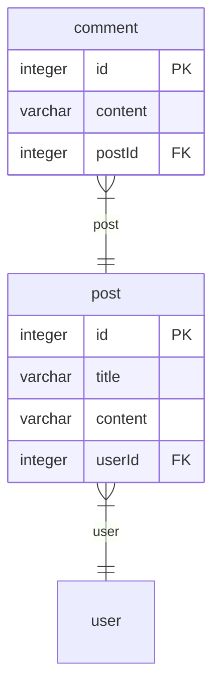
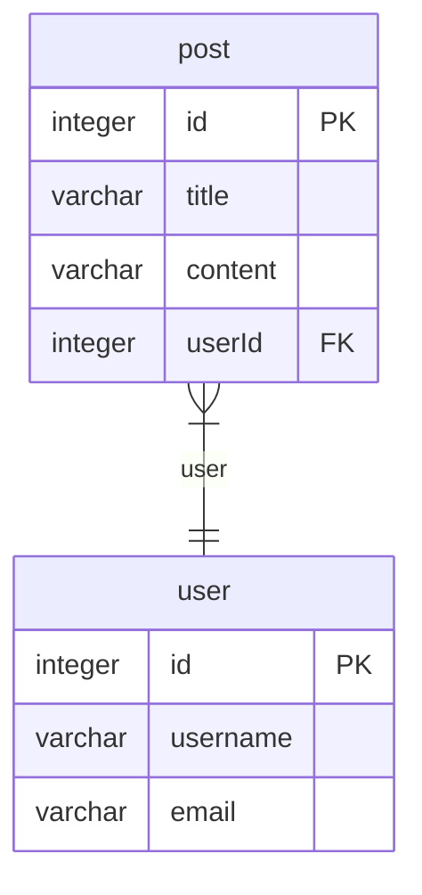

> Generated by [`typeorm-markdown`](https://github.com/hermin9804/typeorm-markdown)

- [Post](#post)
- [User](#user)

## Post

### Comment
Comment entity represents a comment on a post in the application.
@namespace Post

**Properties**
  - `id`: Primary key for the comment.
  - `content`: Content of the comment.
  - `post`: Post to which the comment belongs.

### Post
Post entity represents a blog post in the application.
@namespace Post
@namespace User

**Properties**
  - `id`: Primary key for the post.
  - `title`: Title of the post.
  - `content`: Content of the post.
  - `user`: User who created the post.
  - `comments`: List of comments on the post.

## User

### Post
Post entity represents a blog post in the application.
@namespace Post
@namespace User

**Properties**
  - `id`: Primary key for the post.
  - `title`: Title of the post.
  - `content`: Content of the post.
  - `user`: User who created the post.
  - `comments`: List of comments on the post.

### User
User entity represents a user in the application.
@namespace User

**Properties**
  - `id`: Primary key for the user.
  - `username`: Username of the user.
  - `email`: Email of the user.
  - `posts`: List of posts created by the user.

