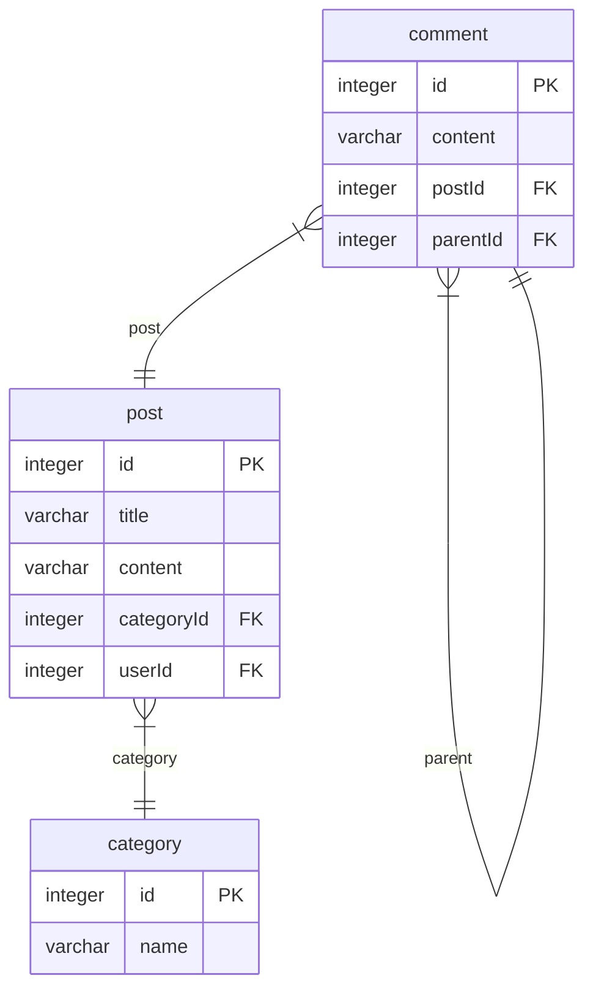
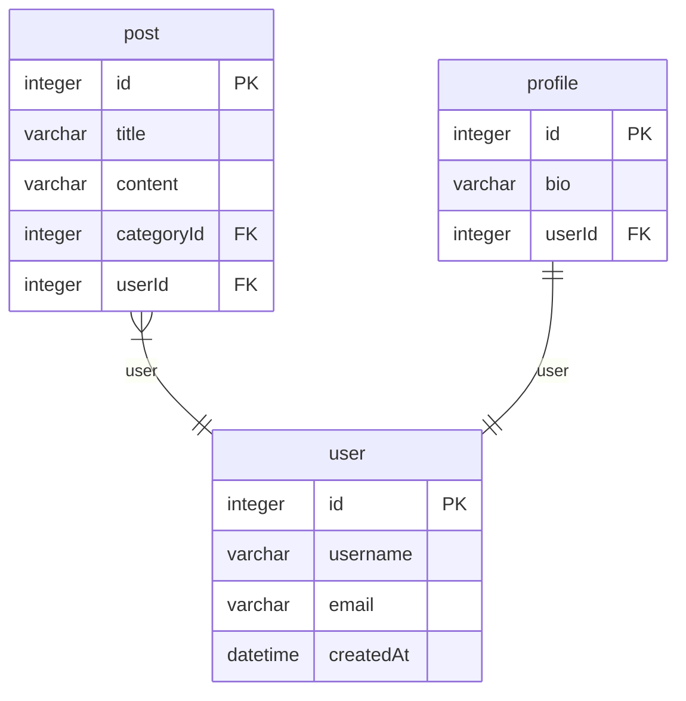

> Generated by [`typeorm-markdown`](https://github.com/hermin9804/typeorm-markdown)

- [Post](#post)
- [User](#user)

## Post

### category

Category entity represents a category of posts.
@namespace Post

**Properties**

  - `id`: Primary key for the category.
  - `name`: Name of the category.
  - `posts`: List of posts under this category.

### comment

Comment entity represents a comment on a post in the application.
@namespace Post

**Properties**

  - `id`: Primary key for the comment.
  - `content`: Content of the comment.
  - `postId`: 
  - `post`: Post to which the comment belongs.
  - `parentId`: 
  - `parent`: Parent comment of the current comment.
  - `replies`: Replies to the current comment.

### post

Post entity represents a post in the application.
@namespace Post
@namespace User

**Properties**

  - `id`: Primary key for the post.
  - `title`: Title of the post.
  - `content`: Content of the post.
  - `user`: User who created the post.
  - `comments`: Comments on the post.
  - `categoryId`: Category ID of the post.
  - `category`: Category of the post.

## User

### post

Post entity represents a post in the application.
@namespace Post
@namespace User

**Properties**

  - `id`: Primary key for the post.
  - `title`: Title of the post.
  - `content`: Content of the post.
  - `user`: User who created the post.
  - `comments`: Comments on the post.
  - `categoryId`: Category ID of the post.
  - `category`: Category of the post.

### profile

Profile entity represents additional user details.
@namespace User

**Properties**

  - `id`: Primary key for the profile.
  - `bio`: Biography of the user.
  - `user`: User associated with this profile.

### user

User entity represents a user in the application.
@namespace User

**Properties**

  - `id`: Primary key for the user.
  - `username`: Username of the user.
  - `email`: Email of the user.
  - `posts`: List of posts created by the user.
  - `profile`: Profile associated with the user.
  - `createdAt`: 

