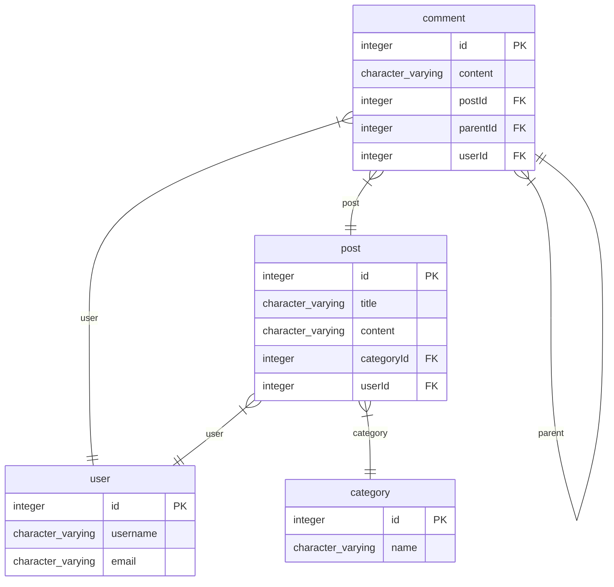
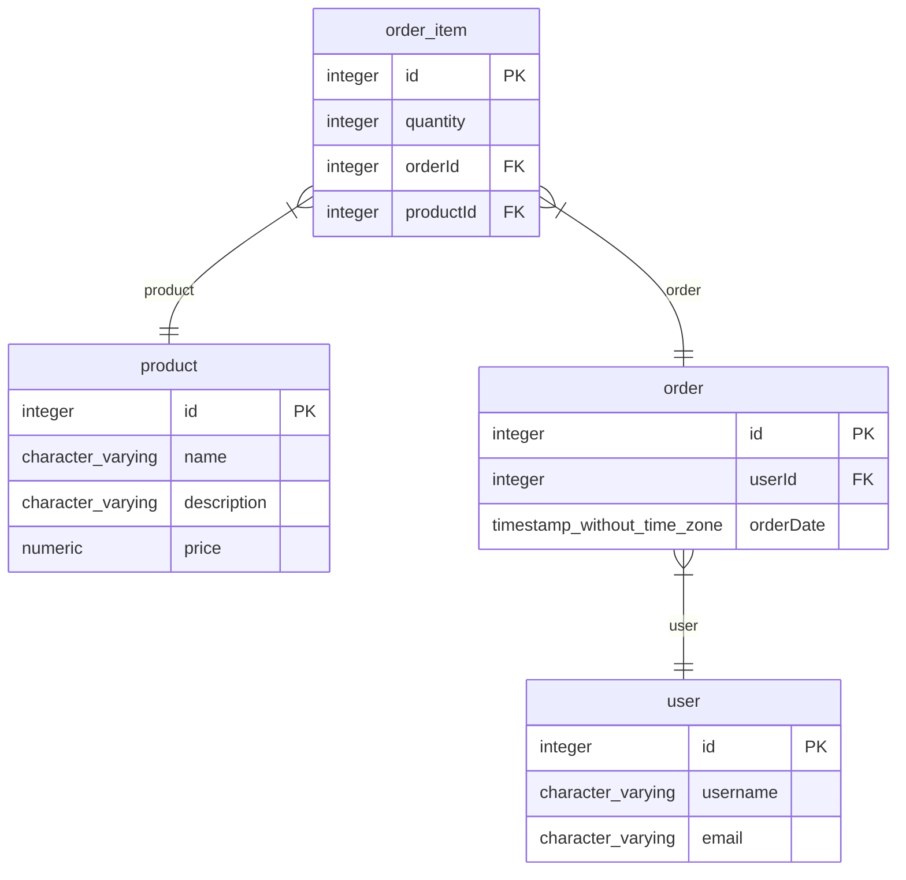
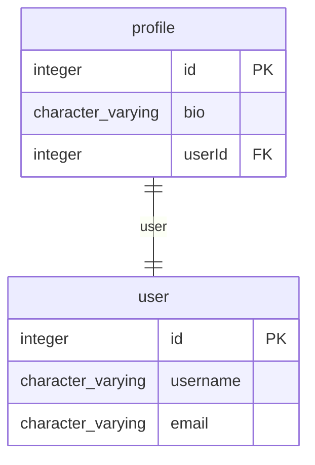

# postgres TypeORM Markdown

> Generated by [`typeorm-markdown`](https://github.com/hermin9804/typeorm-markdown)

## Table of Contents

- [Post](#post)
- [ShoppingMall](#shoppingmall)
- [User](#user)

## Post

### category

Category entity represents a category of posts.
@namespace Post

**Properties**

  - `id`: Primary key for the category.
  - `name`: Name of the category.
  - `posts`: List of posts under this category.

### comment

Comment entity represents a comment on a post in the application.
@namespace Post

**Properties**

  - `id`: Primary key for the comment.
  - `content`: Content of the comment.
  - `postId`: Post ID to which the comment belongs.
  - `parentId`: parent comment id of the current comment.
  - `userId`: User ID who created the comment.
  - `post`: Post to which the comment belongs.
  - `parent`: Parent comment of the current comment.
  - `replies`: Replies to the current comment.
  - `user`: User who created the comment.

### post

Post entity represents a post in the application.
@namespace Post

**Properties**

  - `id`: Primary key for the post.
  - `title`: Title of the post.
  - `content`: Content of the post.
  - `categoryId`: Category ID of the post.
  - `userId`: User ID who created the post.
  - `user`: User who created the post.
  - `category`: Category of the post.
  - `comments`: Comments on the post.

### user

User entity represents a user in the application.
@namespace User
@namespace Post
@namespace ShoppingMall

**Properties**

  - `id`: Primary key for the user.
  - `username`: Username of the user.
  - `email`: Email of the user.
  - `posts`: List of posts created by the user.
  - `profile`: Profile associated with the user.
  - `orders`: Orders placed by the user.
  - `comments`: Comments made by the user.

## ShoppingMall

### order_item

OrderItem entity represents an item in an order in the shopping mall.
@namespace ShoppingMall

**Properties**

  - `id`: Primary key for the order item.
  - `quantity`: Quantity of the product in the order.
  - `orderId`: Order ID to which the item belongs.
  - `productId`: Product ID in the order item.
  - `order`: Order to which this item belongs.
  - `product`: Product in the order item.

### order

Order entity represents an order in the shopping mall.
@namespace ShoppingMall

**Properties**

  - `id`: Primary key for the order.
  - `userId`: User ID who placed the order.
  - `orderDate`: Date the order was placed.
  - `user`: User who placed the order.
  - `orderItems`: List of order items in the order.

### product

Product entity represents a product in the shopping mall.
@namespace ShoppingMall

**Properties**

  - `id`: Primary key for the product.
  - `name`: Name of the product.
  - `description`: Description of the product.
  - `price`: Price of the product.
  - `orderItems`: List of orders that include this product.

### user

User entity represents a user in the application.
@namespace User
@namespace Post
@namespace ShoppingMall

**Properties**

  - `id`: Primary key for the user.
  - `username`: Username of the user.
  - `email`: Email of the user.
  - `posts`: List of posts created by the user.
  - `profile`: Profile associated with the user.
  - `orders`: Orders placed by the user.
  - `comments`: Comments made by the user.

## User

### profile

Profile entity represents additional user details.
@namespace User

**Properties**

  - `id`: Primary key for the profile.
  - `bio`: Biography of the user.
  - `userId`: 
  - `user`: User associated with this profile.

### user

User entity represents a user in the application.
@namespace User
@namespace Post
@namespace ShoppingMall

**Properties**

  - `id`: Primary key for the user.
  - `username`: Username of the user.
  - `email`: Email of the user.
  - `posts`: List of posts created by the user.
  - `profile`: Profile associated with the user.
  - `orders`: Orders placed by the user.
  - `comments`: Comments made by the user.

