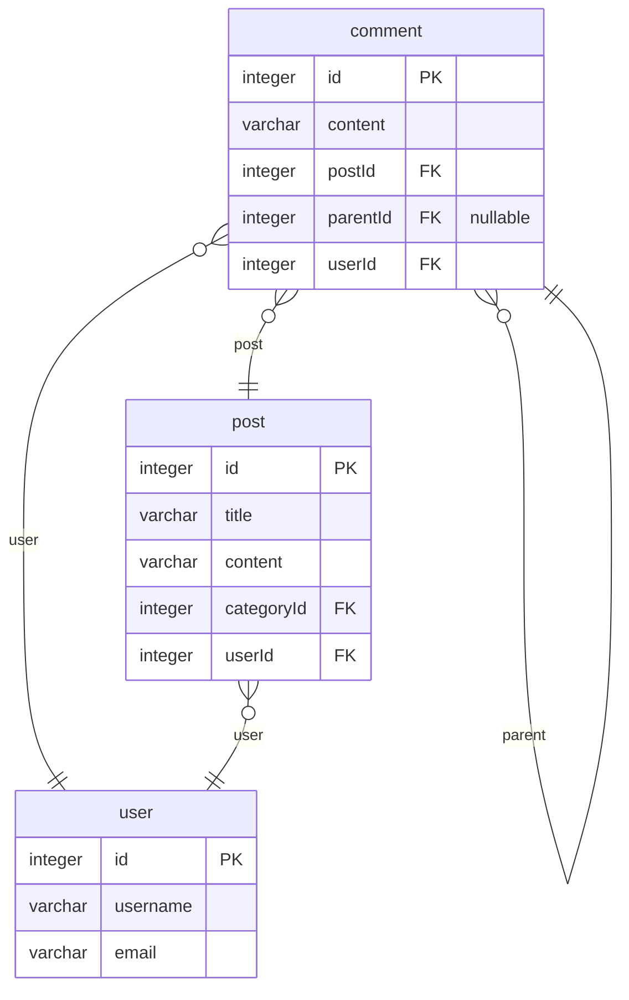
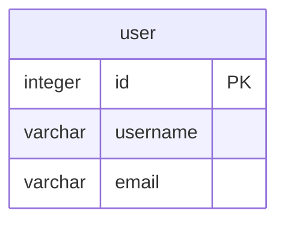
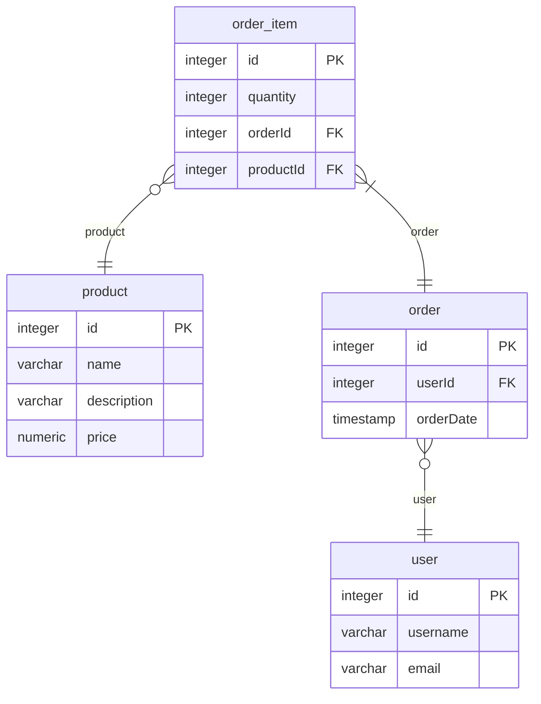

# postgres TypeORM Markdown

> Generated by [`typeorm-markdown-generator`](https://github.com/hermin9804/typeorm-markdown-generator)

## Table of Contents

- [Post](#post)
- [User](#user)
- [ShoppingMall](#shoppingmall)

## Post

### post

Post entity represents a post in the application.
@namespace Post

**Properties**

  - `id`: Primary key for the post.
  - `title`: Title of the post.
  - `content`: Content of the post.
  - `categoryId`: Category ID of the post.
  - `userId`: User ID who created the post.

## User

### profile

Profile entity represents additional user details.
@describe User

**Properties**

  - `id`: Primary key for the profile.
  - `bio`: Biography of the user.
  - `userId`: User ID associated with this profile.

### user

User entity represents a user in the application.
@namespace User
@erd Post
@erd ShoppingMall

**Properties**

  - `id`: Primary key for the user.
  - `username`: Username of the user.
  - `email`: Email of the user.

## ShoppingMall

### product

Product entity represents a product in the shopping mall.
@namespace ShoppingMall

**Properties**

  - `id`: Primary key for the product.
  - `name`: Name of the product.
  - `description`: Description of the product.
  - `price`: Price of the product.

### order_item

OrderItem entity represents an item in an order in the shopping mall.
@namespace ShoppingMall

**Properties**

  - `id`: Primary key for the order item.
  - `quantity`: Quantity of the product in the order.
  - `orderId`: Order ID to which the item belongs.
  - `productId`: Product ID in the order item.

### order

Order entity represents an order in the shopping mall.
@namespace ShoppingMall

**Properties**

  - `id`: Primary key for the order.
  - `userId`: User ID who placed the order.
  - `orderDate`: Date the order was placed.

